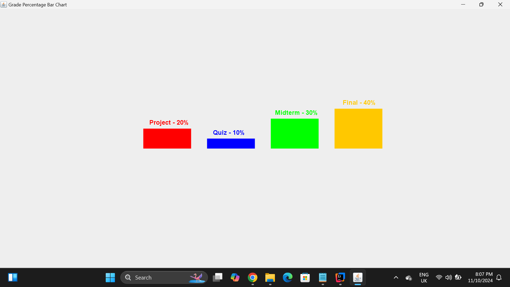

# EnhancedBarChart Project

This Java program creates a bar chart to display the percentages of the overall grade represented by different categories: projects, quizzes, midterm exams, and the final exam. Each category has a unique color and percentage breakdown.

## Project Structure
- **Bar Chart**: Displays grade percentages for four categories:
    - Projects: 20% (Red)
    - Quizzes: 10% (Blue)
    - Midterm Exams: 30% (Green)
    - Final Exam: 40% (Orange)

## Features
- Centered and dynamically sized bar chart.
- Clear labels on top of each bar.
- Uses `Graphics2D` for smooth rendering.

## How to Run
1. Clone this repository:
   ```bash
   git clone https://github.com/Zue-AI/EnhancedBarChart.git
   cd EnhancedBarChart
   ```
2. Compile the Java code:
   ```bash
   javac EnhancedBarChart.java
   ```
3. Run the program:
   ```bash
   java EnhancedBarChart
   ```

## Output
Here is an example of the output generated by the program:



## Requirements
- Java JDK 8 or above.

## License
This project is licensed under the MIT License - see the LICENSE file for details.

## Author
[Zue-AI (Success)](https://www.linkedin.com/in/idogun-successs-96a628319/)
